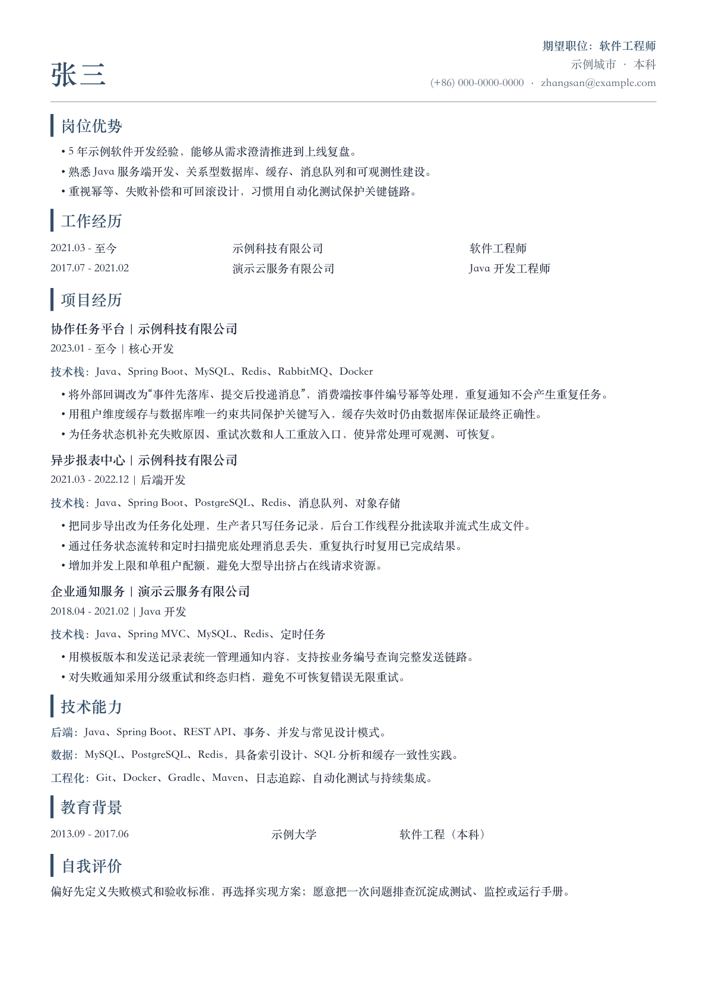

# Resume Workbench

[](https://github.com/Jimmy-Smo/resume-workbench/actions/workflows/ci.yml)
[](LICENSE)
[](README.zh-CN.md)

**A privacy-first Markdown resume and interview-prep workbench.**

Write resumes in Markdown, generate print-ready PDFs with Pandoc and
WeasyPrint, and keep role-specific variants beside curated interview notes.

> All people, companies, schools, projects, dates, metrics, and interview
> answers in this repository are fictional teaching examples.

## Preview

<p align="center">
  <a href="assets/resume-preview.png">
    
  </a>
</p>

## Features

- Chinese and English resume layouts.
- General, Java, backend, and full-stack variants.
- Local PDF generation with reproducible CSS.
- Fictional interview stories, HR answers, and troubleshooting exercises.
- Privacy checks that reject common personal-data and binary-artifact leaks.
- Bundled agent skills for adding a variant and tailoring to a job posting.
- A skill pipeline from real work to application material: mine your own commits
  for project highlights, import an existing `.docx`/`.pdf` resume, generate an
  interview kit, and write a BOSS 直聘 profile.
- No bundled commercial fonts and no resume data sent to a server.

## Quick start

macOS:

```bash
brew install node pandoc pango gdk-pixbuf libffi
```

Debian/Ubuntu:

```bash
sudo apt-get update
sudo apt-get install nodejs npm pandoc python3-venv python3-pip libpango-1.0-0 libpangoft2-1.0-0
```

Then on either platform:

```bash
python3 -m venv .venv
source .venv/bin/activate
pip install -r requirements.txt

npm run check
npm run build:all
```

Generated PDFs are written to `dist/` and are intentionally ignored by Git.
Native Windows is not a supported build target; use WSL2 or a Linux container.

## Commands

| Command | Purpose |
|---|---|
| `npm run build` | Build the default Chinese resume |
| `npm run build:english` | Build the English resume |
| `npm run build:java` | Build the Java-focused resume |
| `npm run build:backend` | Build the backend-focused resume |
| `npm run build:fullstack` | Build the full-stack resume |
| `npm run build:all` | Build every variant |
| `npm run qa -- default` | Build and render preview images when possible |
| `npm run mine -- --all --author "<you>" <repo>` | Survey your own commits in a local repository |
| `npm test` | Run structure, CSS, and privacy checks |

The build script also supports a locally installed WenKai font stack:

```bash
./scripts/build.sh backend --font wenkai
```

Override output labels without editing the script:

```bash
RESUME_NAME_ZH="候选人" YOE_CN="5年" ./scripts/build.sh backend
RESUME_NAME_EN="Candidate" YOE_EN="5YOE" ./scripts/build.sh english
```

## Repository layout

```text
resume/        Fictional Chinese and English resume variants
interview/     Curated fictional interview-preparation examples
styles/        A4 page geometry, font stacks, and themes
scripts/       Build, archive, QA, cleanup, mining, and privacy tooling
tests/         Shell-based interface and content checks
.agents/skills/  Agent skills (symlinked into .claude/skills/ for Claude Code)
dist/          Generated local PDFs and previews (ignored)
archive/       Optional local snapshots (ignored)
local/         Your real content: evidence, interview kit, BOSS profile (ignored)
```

## Development workflow

- `main` is the protected release branch. Direct pushes, force pushes, and
  branch deletion are blocked.
- `dev` is the integration branch for ongoing work. Open contribution PRs
  against `dev`.
- For a release, open a `dev` to `main` PR, wait for CI, merge it, then tag the
  merge commit.

## Using this template safely

Create a **private** repository from this template before adding real data.
Do not commit personal contact information, employment history, or generated
PDFs to a public fork. `npm run privacy:check` is a guardrail, not a guarantee;
review the full Git history before changing a personalized repository to
public.

The local privacy check examines the exact staged snapshot. Stage everything
you intend to commit, inspect the staged diff, and then run the check:

```bash
git add --all
git diff --cached
npm run privacy:check
```

Untracked and unstaged content is outside that snapshot. CI adds a full-history
Gitleaks scan, but neither check replaces a manual privacy review.

Real personal content belongs in `local/`, which is ignored by Git and rejected
by the privacy check if it is ever tracked. The agent skills write there by
default and only target `resume/` and `interview/` once you opt in on this
machine:

```bash
mkdir -p local && touch local/.private-ok
```

That marker also puts `privacy:check` into personal mode, which is what lets a
private fork commit a real email address and phone number without failing
`npm test`. It relaxes the contact rules only — tracked binaries, home paths,
and credential patterns are still rejected. Because `local/` is ignored, the
marker never travels with a fork, and CI never enters personal mode.

## Design and fonts

The layout draws on ideas from [Kami](https://github.com/tw93/Kami); see
[third-party notices](THIRD_PARTY_NOTICES.md). Commercial font files are not
included. The default uses system serif fonts; `--font wenkai` prefers a
locally installed LXGW WenKai-compatible font and falls back safely.

## License

Apache License 2.0. See [LICENSE](LICENSE) and [NOTICE](NOTICE).
